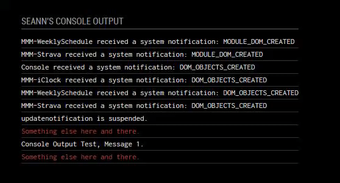

# Console Output for MagicMirror²

This is a module for the [MagicMirror²](https://github.com/MichMich/MagicMirror/).

I created this module to give more of a "nerdy" feel to my mirror.
Displaying the developers console log directly to the mirror.

For the moment it's quite basic. The current config only allows you to change the number of lines displayed and the color for each function.

## Preview




## Installation

Installation is very simple, just clone the git into your modules directory then add the module to your config.

```shell
cd ~/MagicMirror/modules
git clone https://github.com/aSeann/Console
```

## Using the module

To use this module, add the following configuration block to the modules array in the `config/config.js` file:
```js
var config = {
    modules: [
			{
				module: "Console",
				header: "Console Output",
				position: "bottom_left",
				config: {
					lines: 15,
				}
			},
    ]
}
```
